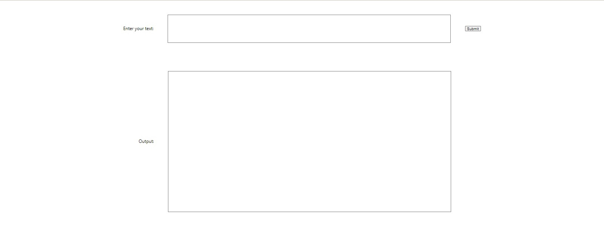
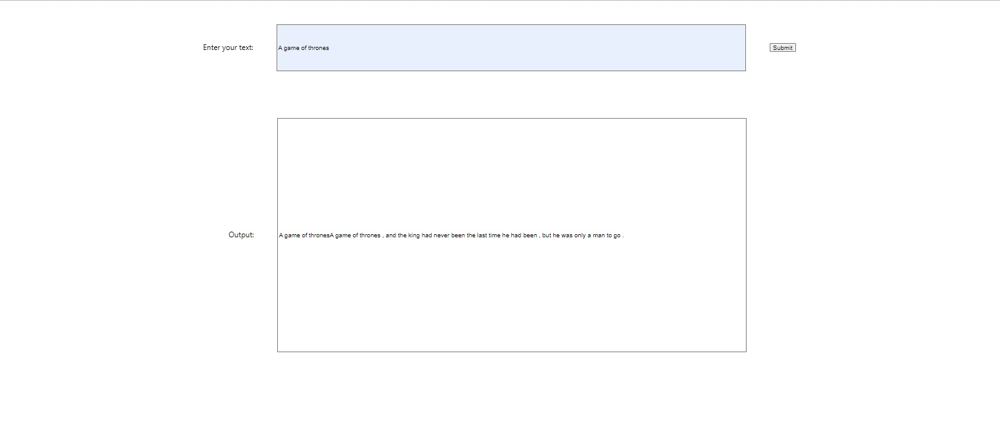

This is a text-generation engine project that generates text according to the provided texts. In this project, the game of thrones text is used for the trainning dataset.

To use this app, you can either clone or download on your local machine, and then right click at the docker-compose file, then click compose up for lauching the app.

When launching the app, you will see two textboxes and a button. To use the model, you need to type a phrase or a sentence about game of thrones. then you will see a bunch of text on the textbox below.

